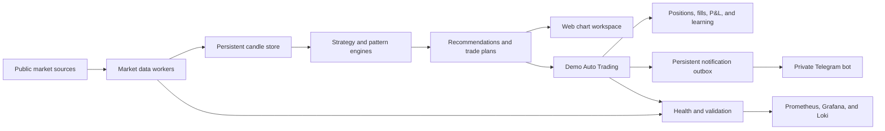

# Trader Helper

Private multi-market technical analysis, trade-alert, and simulated execution system for personal research.

> **Access status:** This project is currently operated as a private, single-user system. It is not offered as a public service, trading product, or supported self-hosted application. Public installation and deployment instructions are intentionally not included.

## Overview

Trader Helper combines live market charts, rule-based technical analysis, trade planning, persistent outcome tracking, and a forward-only demo trading account in one interface.

The system is designed to answer four practical questions:

1. What is the current trend and market regime?
2. Is there a technically valid long or short opportunity?
3. Where are the entry, invalidation, and profit targets?
4. How have comparable recommendations performed over time?

It does not connect to a broker for order execution and cannot place real trades. All automatic trading activity is restricted to the simulated Demo Auto Trading account.

## Market Coverage

| Market | Primary purpose | Supported analysis |
| --- | --- | --- |
| QQQ | Nasdaq-100 momentum and options context | Intraday and swing |
| SPY | Broad US market confirmation and momentum | Intraday and swing |
| BTC-USD | Continuous cryptocurrency momentum | Intraday, swing, and long term |
| TA-125 | Tel Aviv large-cap market analysis | Intraday and swing |

The interface supports 1-minute, 5-minute, 15-minute, and daily candles. Each market maintains its own chart state, recommendations, trade history, calibration samples, and data-health status.

## Chart And Analysis Workspace

The chart is built for active review rather than passive price display.

- Candlestick charts with pan, zoom, future chart space, and live-view restoration
- Current-price label and cursor price inspection
- Regular and extended-session differentiation
- Volume histogram and timeframe-specific RSI pane
- VWAP and moving averages for 20, 50, and 150 periods
- Entry arrows, stop levels, Target 1, and Target 2 overlays
- General Trend summary across 1m, 5m, 15m, and 1D
- Mobile layout optimized separately from the desktop workspace

## Technical Analysis Engine

The server is the single authority for analysis and recommendations. The browser displays server decisions but does not generate substitute trades.

The engine evaluates:

- EMA and SMA structure
- RSI momentum and exhaustion
- ATR volatility and stop distance
- VWAP position and session behavior
- Relative volume and volume confirmation
- Opening range behavior
- Support, resistance, breakout, breakdown, and retest structure
- Current momentum, trend alignment, long/short bias, and market regime
- Execution quality, estimated slippage, and reward-to-risk quality
- Historical edge and score calibration

Every actionable recommendation contains a direction, entry, stop, two profit targets, score drivers, invalidation conditions, and the next missing confirmation. If no candidate meets the active quality gates, the system shows no trade recommendation.

## Pattern Recognition

Pattern detection uses closed candles and excludes extended-hours candles from intraday pattern formation.

Supported structures include:

- Head and shoulders and inverse head and shoulders
- Double and triple tops and bottoms
- Bull and bear flags
- Pennants, triangles, wedges, rectangles, and channels
- Cup and handle and rounded reversals
- Engulfing candles, hammers, shooting stars, and dojis
- Morning and evening stars

Only the strongest valid current pattern is shown. Selecting it displays the measured-move projection. Pattern scores rank geometric quality; they are not presented as guaranteed probabilities.

## Trade Recommendation Lifecycle

Recommendations are treated as persistent trade plans rather than temporary chart labels.

1. A setup is identified from closed-candle evidence.
2. Data quality and execution-quality gates are checked.
3. Entry, stop, and target geometry is validated.
4. The plan is tracked through entry, targets, stop, expiry, or invalidation.
5. The outcome is saved for later calibration and review.

Long and short opportunities are evaluated independently. Intraday and swing recommendations use different volatility limits, holding assumptions, and confirmation rules.

## Demo Auto Trading

Demo Auto Trading is a permanent simulated account that began with a $20,000 balance. Only the system can open or close demo positions; there is no user order-entry capability.

The current simulation models:

- Day, swing, and long-term positions running simultaneously
- Long and fully collateralized short positions
- No leverage
- At least two day-trade entries per rolling 24-hour period when valid data and capacity permit
- At least 85% capital deployment, targeting 87%
- A hard $1,000 minimum value for every new trade
- A $5 commission on every entry, partial exit, and final exit
- A 25% deduction from profitable completed trades to simulate taxes
- No tax credit for losing trades
- Asset-specific slippage and cost-aware stops
- Persistent positions, fills, cash ledger, equity curve, P&L, and drawdown

The simulation is forward-only and has no reset. Its purpose is to create an auditable sample of how the live decision process behaves under explicit costs and execution assumptions.

## Persistent Learning And Validation

Every independent recommendation and demo trade outcome is stored for analysis. The learning system separates evidence by market, timeframe, direction, setup, regime, session, strategy version, and execution policy.

The system includes:

- Chronological historical replay
- Train and holdout evaluation
- Rolling forward validation folds
- Expected return in R, win rate, profit factor, drawdown, and sample coverage
- Probability calibration with conservative priors
- Calibration-drift monitoring by score band
- Shadow candidates for rejected and near-threshold setups
- Shadow challenger policies and context routing
- Duplicate-thesis isolation so repeated refreshes do not create false evidence

Learning results do not automatically rewrite production rules. A proposed change requires sufficient independent evidence, positive holdout behavior, stable execution-adjusted results, and manual review.

## Telegram Alerts

The private Telegram bot reports Demo Auto Trading activity while the browser is closed.

Alerts include:

- New demo positions
- Partial profit-taking
- Stop exits
- Final exits
- Entry value and quantity
- Entry, stop, targets, score, reward-to-risk, costs, and realized P&L

Notifications are written to a persistent outbox in the same transaction as each immutable fill. Failed deliveries are retried, successful channels are recorded, and application restarts do not discard pending messages.

## Data Quality

The system uses best-effort public market data and does not claim exchange-grade execution data.

- US ETFs and TA-125 analysis use Yahoo Finance market history
- BTC-USD uses a public Coinbase trade stream with historical backfill
- Independent price checks can identify stale or mismatched quotes
- Synthetic prices are never substituted when a provider fails
- Recommendations pause when required data is stale, incomplete, or inconsistent
- CNN Fear & Greed is displayed as market context but does not directly change trade scores

Provider status, candle freshness, timeframe gaps, cross-validation, and recommendation eligibility are visible inside the application.

## Reliability And Monitoring

The system runs continuously with persistent state and operational monitoring.

- SQLite-backed account, journal, fills, outcomes, and notification outbox
- Immutable cash ledger and reconciliation checks
- Automatic integrity-checked backups
- Worker and provider health monitoring
- Stale-data and stop-breach detection
- Prometheus metrics
- Grafana operational dashboards
- Loki log aggregation
- CPU, application health, incidents, demo-account status, and notification delivery visibility

## Architecture

## Current Boundaries

- No real-money order execution
- No broker trading permissions
- No public accounts or multi-user access
- No public API access
- No guarantee of real-time exchange-grade data
- No automatic promotion of learned strategy changes
- No claim that a score or pattern represents a guaranteed outcome

## Private Project Status

Trader Helper is under active personal development. Access, credentials, infrastructure details, operating procedures, and deployment documentation are intentionally restricted. The repository describes what the system does without providing a public path to operate it.

## Disclaimer

This software is a personal research and simulation tool. It is not financial advice, an investment recommendation, a brokerage service, or a promise of profitability. Market data can be delayed or incorrect, and technical analysis can fail. Any real trading decision remains entirely the user's responsibility.
